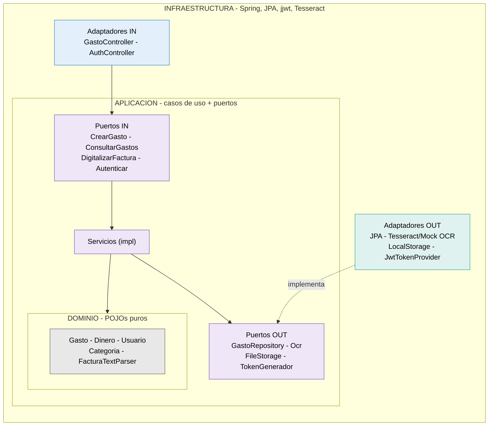

# GestionFacturas — Control económico para autónomos

> **Proyecto en desarrollo activo.** Este README describe el estado actual y la
> dirección del proyecto, y evoluciona con él.

Aplicación para que **freelances y autónomos individuales** lleven el control de su
actividad económica: registran sus **gastos** (e ingresos y clientes en fases futuras),
digitalizan facturas con OCR, y las mantienen ordenadas para entregar al gestor.

Principio rector: **organización y visibilidad, nunca asesoría fiscal ni facturación
oficial**. La app registra y reporta; no calcula la declaración ni emite facturas legales.

## El problema que resuelve

Gestionar la contabilidad siendo autónomo es un caos manual: facturas desperdigadas,
datos tecleados a mano, y un desastre que ordenar cada trimestre. La app ataca ese dolor
siendo fuerte en cuatro cosas: capturar sin esfuerzo (foto -> datos), no perder nada,
entender el dinero, y entregar ordenado al gestor.

## Público objetivo

Freelances y autónomos individuales (desarrolladores, diseñadores, consultores,
oficios...) que trabajan con un gestor externo. La app no sustituye al gestor: le da el
trabajo ya ordenado.

## Stack tecnológico

| Capa | Tecnología |
|------|-----------|
| Lenguaje | Java 21 |
| Framework | Spring Boot 4.1.x |
| Base de datos | PostgreSQL |
| Migraciones | Flyway |
| Seguridad | Spring Security + JWT (access + refresh revocable) |
| OCR | Tesseract vía Tess4J (idioma español); mock para desarrollo/tests |
| Almacenamiento de archivos | Sistema de archivos local (MinIO planificado) |
| Documentación API | OpenAPI / Swagger (springdoc 3.x) |
| Build | Maven |
| Tests | JUnit 5 + Mockito + AssertJ |
| Entorno | Docker Compose (PostgreSQL) |
| Cliente | Flutter *(planificado)* |

## Arquitectura

Arquitectura **hexagonal (puertos y adaptadores)**, en tres capas con las dependencias
apuntando siempre hacia el dominio:

- **domain** — núcleo de negocio. POJOs puros, sin Spring ni JPA.
- **application** — casos de uso + puertos (interfaces in/out).
- **infrastructure** — adaptadores (web, persistencia, OCR, storage, seguridad) + config.

**Regla de dependencia:** `infrastructure` conoce `application`, que conoce `domain`. El
dominio no conoce a nadie. La aplicación **define** los puertos; la infraestructura los
**implementa**.



Para cada entidad hay **tres modelos separados** a propósito: DTO (contrato de la API),
modelo de dominio (negocio) y entidad JPA (persistencia). Los mappers traducen entre ellos.

## Flujo de datos

### Digitalizar una factura (Fase 1)

```
POST /api/gastos/digitalizar  (multipart: imagen de factura)
   │
   ▼
GastoController          (adaptador IN — MultipartFile -> byte[])
   ▼
DigitalizarFacturaUseCase   (puerto IN)
   ▼
DigitalizarFacturaService   (orquesta):
   ├─► FileStoragePort ────► almacena el archivo, devuelve referencia
   ├─► OcrPort ────────────► Tesseract extrae el texto (o mock)
   ├─► FacturaTextParser ──► texto -> campos (emisor, fecha, importes)
   └─► GastoRepositoryPort ► guarda el Gasto en BORRADOR
   ▼
Gasto en BORRADOR (el usuario revisa y completa lo que el OCR no pilló)
```

### Login

```
POST /api/auth/login
   ▼
AutenticarService: busca usuario -> BCrypt.matches -> genera access + refresh token
   ▼
devuelve access token (15 min) + refresh token (7 días, hash guardado en BD)
```

## Seguridad

- Contraseñas hasheadas con **BCrypt**.
- Autenticación **JWT**: access token corto + refresh token revocable (hash en BD).
- Logout real: revoca el refresh token en BD. Rotación de tokens: pendiente (roadmap).
- El usuario autenticado se obtiene en los controllers con `@AuthenticationPrincipal`.

## Estado actual

**Fase 0 — Fundamentos** ✅ cerrada y testeada
- Dominio, casos de uso y persistencia de gasto/categoría/usuario, controllers, manejo de
  errores, Flyway, Docker, tests unitarios de dominio y servicios.

**Seguridad (JWT)** ✅ implementada
- Registro, login (TDD), JwtTokenProvider, filtro de autenticación, SecurityConfig
  endurecida, refresh tokens revocables (`/refresh`, `/logout`).
- Pendiente: rotación de refresh tokens (reuse detection).

**Fase 1 — Digitalización (OCR)** ✅ funcional
- Almacenamiento de archivos local, OCR con Tesseract (español) + mock por perfil,
  parser de facturas (importes y fecha), endpoint de subida, referencia del archivo
  guardada en el gasto.
- Pendiente/mejora: soporte de PDF (ahora solo imágenes), extracción del emisor,
  procesamiento asíncrono del OCR, migrar almacenamiento a MinIO.

## Roadmap

| Fase | Foco |
|------|------|
| Fase 0 | Backend en pie, CRUD de gasto (hecho) |
| Seguridad | Autenticación JWT completa (hecho; falta rotación) |
| Fase 1 | OCR + almacenamiento de archivos (hecho; falta PDF, emisor, async, MinIO) |
| Fase 2 | Ingresos y clientes |
| Fase 3 | Dashboard: beneficio por periodo, rentabilidad por cliente, pendientes de cobro |
| Fase 4 | Exportación al gestor, pulido, despliegue |
| v1+ | Duplicados, recurrentes, presupuestos, categorización automática... |

## Cómo arrancar (desarrollo)

**Requisitos:** Java 21, Docker, Maven. Para OCR real: Tesseract instalado con el idioma
español (`spa`).

```bash
# 1. Levantar PostgreSQL
docker compose up -d

# 2. Variables de entorno (ver .env.example): credenciales BD, JWT_SECRET,
#    y la ruta de tessdata para OCR.

# 3. Arrancar
./mvnw spring-boot:run
```

- **Modo desarrollo (mock OCR):** arranca sin perfil especial; el OCR devuelve texto
  simulado, no requiere Tesseract.
- **Modo OCR real:** arranca con el perfil `ocr` activo
  (`SPRING_PROFILES_ACTIVE=ocr`) y la ruta de `tessdata` configurada. El OCR usa Tesseract.

API en `http://localhost:8080`. Swagger UI en `http://localhost:8080/swagger-ui.html`
(con botón "Authorize" para el token JWT).

## Tests

```bash
./mvnw test
```

Tests unitarios de dominio (`Dinero`, `Gasto`, `FacturaTextParser`), de servicios (con
Mockito) y del generador de tokens. El login y el parser se trabajaron con TDD. Los tests
usan el mock de OCR, nunca Tesseract real.

## Variables de entorno

Ver `.env.example`. Principales: `DB_URL`, `DB_USERNAME`, `DB_PASSWORD`, `JWT_SECRET`,
`SERVER_PORT`, y la ruta de datos de Tesseract para OCR. Nunca subir el `.env` real ni la
clave JWT a Git.

---

*Proyecto personal en desarrollo. La documentación se amplía conforme avanzan las fases.*
