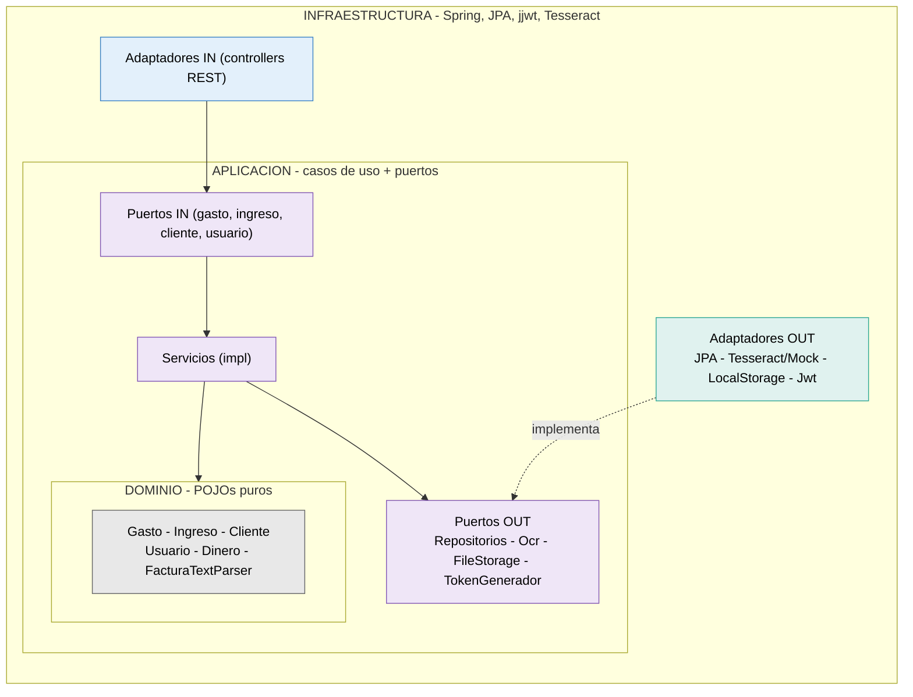

# GestionFacturas — Control económico para autónomos

> ⚠️ **Proyecto en desarrollo activo.** Este README describe el estado actual y la
> dirección del proyecto, y evoluciona con él.

Aplicación para que **freelances y autónomos individuales** lleven el control de su
actividad económica: registran sus **gastos**, sus **ingresos** y sus **clientes**,
digitalizan facturas con OCR, y lo mantienen ordenado para entregar al gestor. El objetivo
es dar visión de beneficio y de rentabilidad por cliente.

Principio rector: **organización y visibilidad, nunca asesoría fiscal ni facturación
oficial**. La app registra y reporta; no calcula la declaración ni emite facturas legales.

## El problema que resuelve

Gestionar la contabilidad siendo autónomo es un caos manual: facturas desperdigadas,
ingresos sin controlar, cobros que se pierden de vista, y un desastre que ordenar cada
trimestre. La app ataca ese dolor siendo fuerte en cuatro cosas: capturar sin esfuerzo
(foto -> datos), no perder nada, entender el dinero (qué entra, qué sale, cuánto queda,
quién me debe, por cliente), y entregar ordenado al gestor.

## Público objetivo

Freelances y autónomos individuales que trabajan con un gestor externo. La app no sustituye
al gestor: le da el trabajo ya ordenado.

## Stack tecnológico

| Capa | Tecnología |
|------|-----------|
| Lenguaje | Java 21 |
| Framework | Spring Boot 4.1.x |
| Base de datos | PostgreSQL |
| Migraciones | Flyway |
| Seguridad | Spring Security + JWT (access + refresh revocable) |
| Rate limiting | Bucket4j (en memoria) |
| OCR | Tesseract vía Tess4J (español); mock para desarrollo/tests |
| Almacenamiento de archivos | Sistema de archivos local (MinIO planificado) |
| Documentación API | OpenAPI / Swagger (springdoc 3.x) |
| Build | Maven |
| Tests | JUnit 5 + Mockito + AssertJ |
| Entorno | Docker Compose (PostgreSQL) |
| Cliente | Kotlin Multiplatform (KMP) + Compose Multiplatform *(planificado; móvil + escritorio)* |

## Arquitectura

Arquitectura **hexagonal (puertos y adaptadores)**, tres capas con las dependencias
apuntando siempre hacia el dominio:

- **domain** — núcleo de negocio. POJOs puros, sin Spring ni JPA.
- **application** — casos de uso + puertos (interfaces in/out).
- **infrastructure** — adaptadores (web, persistencia, OCR, storage, seguridad) + config.

**Regla de dependencia:** `infrastructure` conoce `application`, que conoce `domain`. El
dominio no conoce a nadie. La aplicación **define** los puertos; la infraestructura los
**implementa**. Para cada entidad hay tres modelos separados (DTO / dominio / entidad JPA)
con mappers entre ellos.



## Módulos de dominio

- **gasto** — dinero que sale. Manual o por OCR. Estado, deducible, referencia al archivo.
  Opcionalmente imputable a un cliente (nullable — muchos gastos son generales).
- **ingreso** — dinero que entra: facturas emitidas a un cliente. Importe (base/IVA/total),
  concepto, y **estado de cobro** (PENDIENTE/COBRADA) con fecha. El usuario marca el cobro a
  mano (la app no se conecta al banco). Transiciones `registrarCobro` y `revertirCobro`.
- **cliente** — a quién factura el usuario. Nombre, NIF, email, teléfono. NIF único por
  usuario. Soft delete (`activo`).
- **usuario** — identidad y autenticación.
- **shared** — `Dinero` (objeto de valor).

## Seguridad

- Contraseñas con **BCrypt**. Autenticación **JWT**: access token corto + refresh token
  revocable (hash SHA-256 en BD). Logout real. Control de acceso por `usuarioId`: cada
  usuario solo ve y opera sobre sus datos.
- **Rate limiting** (Bucket4j, en memoria) para frenar abuso:
  - Login: 10 peticiones/minuto por IP (frena fuerza bruta de credenciales).
  - Registro: 5 peticiones/hora por IP (frena creación masiva de cuentas).
  - Resto de endpoints: 50 peticiones/minuto por usuario autenticado.
  - Al superar el límite: HTTP 429 con cabecera `Retry-After`.

### Seguridad prevista (pendiente, sobre todo para el despliegue)

Estas capas están identificadas y priorizadas para más adelante — la mayoría tienen sentido
al desplegar, no en desarrollo local:

- Rotación de refresh tokens (detección de reuso).
- Configuración de CORS (al conectar el cliente KMP).
- Cabeceras de seguridad HTTP (HSTS, X-Content-Type-Options, CSP) al desplegar tras HTTPS.
- Rate limiting distribuido con Redis (al escalar a varias instancias).
- IP real del cliente vía `X-Forwarded-For` (tras un proxy de confianza).
- Límite de tamaño de peticiones y subidas de archivos.
- Expiración de buckets de rate limiting inactivos (ahora crecen sin límite en memoria).
- Secretos en un gestor de secretos en producción (ahora en `.env`).

## Digitalización (OCR)

Subes una imagen de factura -> se almacena -> Tesseract extrae el texto -> `FacturaTextParser`
saca los campos -> se crea el gasto en BORRADOR para revisar. OCR real con el perfil `ocr`;
mock por defecto. Pendiente: PDF, emisor, OCR asíncrono, MinIO, digitalización de ingresos.

## Estado actual

- **Fase 0 — Fundamentos** ✅ cerrada y testeada.
- **Seguridad (JWT + rate limiting)** ✅ implementada (falta rotación de tokens; ver
  seguridad prevista).
- **Fase 1 — Digitalización (OCR)** ✅ funcional para gastos.
- **Fase 2 — Ingresos y clientes** ✅ cerrada (cliente con soft delete, ingreso con estado
  de cobro y transiciones, gastos e ingresos ligables a cliente).
- **Fase 3 — Dashboard** ⬜ siguiente: beneficio por periodo, rentabilidad por cliente,
  pendientes de cobro, total facturado.

## Roadmap

| Fase | Foco |
|------|------|
| Fase 0 | Backend en pie, CRUD de gasto (hecho) |
| Seguridad | JWT + rate limiting (hecho; ver seguridad prevista) |
| Fase 1 | OCR + almacenamiento de archivos (hecho; faltan mejoras) |
| Fase 2 | Ingresos y clientes (hecho) |
| Fase 3 | Dashboard: beneficio, rentabilidad por cliente, pendientes de cobro |
| Fase 4 | Exportación al gestor, pulido, despliegue |
| Cliente | App KMP (móvil + escritorio) consumiendo la API |
| v1+ | Duplicados, recurrentes, presupuestos, categorización automática... |

## Cómo arrancar (desarrollo)

**Requisitos:** Java 21, Docker, Maven. Para OCR real: Tesseract con el idioma español.

```bash
docker compose up -d                 # PostgreSQL
cp .env.example .env                 # y rellenar (BD, JWT_SECRET, ruta tessdata)
./mvnw spring-boot:run               # arranca (mock OCR por defecto)
```

- **Modo mock OCR:** arranque normal, no requiere Tesseract.
- **Modo OCR real:** perfil `ocr` activo (`SPRING_PROFILES_ACTIVE=ocr`) + ruta de tessdata.

API en `http://localhost:8080`. Swagger UI en `http://localhost:8080/swagger-ui.html`
(botón "Authorize" para el token JWT).

## Tests

```bash
./mvnw test
```

Tests unitarios de dominio y servicios (JUnit 5 + Mockito + AssertJ). El login, el parser
de facturas, las reglas de cliente y las transiciones de cobro del ingreso se construyeron
con TDD. Los tests usan el mock de OCR, nunca Tesseract real.

## Variables de entorno

Ver `.env.example`: `DB_URL`, `DB_USERNAME`, `DB_PASSWORD`, `JWT_SECRET`, `SERVER_PORT`, y
la ruta de datos de Tesseract. Nunca subir el `.env` real ni la clave JWT a Git.

---

*Proyecto personal en desarrollo. La documentación se amplía conforme avanzan las fases.*
