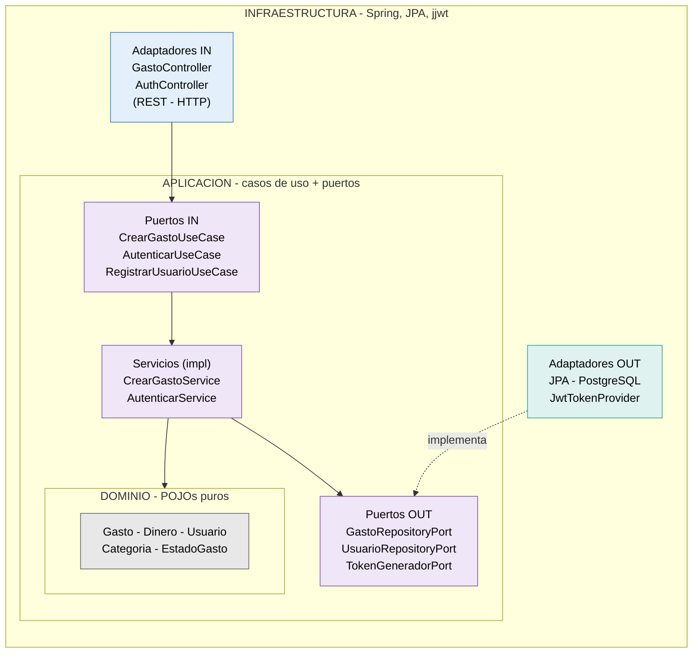

# GestionFacturas — Control económico para autónomos

> **Proyecto en desarrollo activo.** Este README describe el estado actual y la
> dirección del proyecto, y evoluciona con él.

Aplicación para que **freelances y autónomos individuales** lleven el control de su
actividad económica: registran sus **gastos** e **ingresos**, los ligan a **clientes**,
y obtienen una visión de su beneficio y su rentabilidad por cliente — dejándolo todo
ordenado para entregar al gestor.

Principio rector: **organización y visibilidad, nunca asesoría fiscal ni facturación
oficial**. La app registra y reporta; no calcula la declaración ni emite facturas legales.

## El problema que resuelve

Gestionar la contabilidad siendo autónomo es un caos manual: facturas de gastos
desperdigadas, ingresos sin controlar, y un desastre que ordenar cada trimestre. La app
ataca ese dolor siendo fuerte en cuatro cosas: capturar sin esfuerzo, no perder nada,
entender el dinero (qué entra, qué sale, cuánto queda), y entregar ordenado al gestor.

## Público objetivo

Freelances y autónomos individuales (desarrolladores, diseñadores, consultores,
oficios...) que trabajan con un gestor externo. La app no sustituye al gestor: le da el
trabajo ya ordenado.

## Stack tecnológico

| Capa | Tecnología |
|------|-----------|
| Lenguaje | Java 21 |
| Framework | Spring Boot 4.1.x |
| Base de datos | PostgreSQL |
| Migraciones | Flyway |
| Seguridad | Spring Security + JWT (access + refresh revocable) |
| Documentación API | OpenAPI (springdoc) |
| Build | Maven |
| Tests | JUnit 5 + Mockito + AssertJ |
| Entorno | Docker Compose |
| Cliente | Flutter *(planificado)* |

## Arquitectura

Arquitectura **hexagonal (puertos y adaptadores)**, en tres capas con las dependencias
apuntando siempre hacia el dominio:

- **domain** — núcleo de negocio. POJOs puros, sin Spring ni JPA.
- **application** — casos de uso + puertos (interfaces in/out).
- **infrastructure** — adaptadores (web, persistencia, seguridad) + configuración.

**Regla de dependencia:** `infrastructure` conoce `application`, que conoce `domain`. El
dominio no conoce a nadie. La aplicación **define** los puertos; la infraestructura los
**implementa**.



Para cada entidad hay **tres modelos separados** a propósito: el DTO (contrato de la API),
el modelo de dominio (negocio) y la entidad JPA (persistencia). Los mappers traducen entre
ellos, desacoplando la API y la base de datos del núcleo.

### Estructura de paquetes

```
com.fabio.GestionFacturas
├── domain
│   ├── gasto       -> Gasto, EstadoGasto, GastoInvalidoException
│   ├── categoria   -> Categoria
│   ├── usuario     -> Usuario, CredencialesInvalidasException, EmailYaRegistradoException
│   └── shared      -> Dinero (objeto de valor)
├── application
│   ├── gasto       -> puertos (in/out) + servicios
│   ├── categoria   -> puertos + servicio
│   ├── usuario     -> puertos (in/out) + servicios (registro, login)
│   └── shared      -> puertos genericos (OCR, storage, export) [fases futuras]
└── infrastructure
    ├── adapter/in/web          -> controllers, DTOs, web mappers
    ├── adapter/out/persistence -> entidades JPA, repositorios, adaptadores, mappers
    └── config                  -> SecurityConfig, seguridad (JwtTokenProvider)
```

## Flujo de datos

### Flujo: crear un gasto

```
POST /api/gastos
   │
   ▼
GastoController          (adaptador IN — traduce HTTP a comando)
   │  usa el puerto
   ▼
CrearGastoUseCase        (puerto IN)
   │
   ▼
CrearGastoService        (aplicación — convierte importes a Dinero)
   │  construye
   ▼
Gasto                    (dominio — valida invariantes)
   │  persiste vía puerto
   ▼
GastoRepositoryPort      (puerto OUT)
   │
   ▼
GastoPersistenceAdapter  (adaptador OUT — mapea a JPA)
   │
   ▼
PostgreSQL
```

### Flujo: login

```
POST /api/auth/login
   │
   ▼
AuthController           (adaptador IN)
   │
   ▼
AutenticarUseCase        (puerto IN)
   │
   ▼
AutenticarService        (aplicación)
   ├─► UsuarioRepositoryPort ──► busca por email
   ├─► PasswordEncoder ───────► BCrypt.matches (verifica)
   └─► TokenGeneradorPort ────► JwtTokenProvider (firma el JWT)
   │
   ▼
devuelve access token
```

Todo lo que cruza los puertos son objetos de dominio o tipos simples; las entidades JPA no
salen de la persistencia, ni jjwt entra en la capa de aplicación.

## Seguridad

- Contraseñas hasheadas con **BCrypt** (nunca en claro).
- Autenticación con **JWT**: access token corto + refresh token revocable en BD.
- El id del usuario viaja como *subject* del token; el email como *claim* informativo.
- El login devuelve el mismo error para email inexistente y contraseña incorrecta, para no
  revelar qué emails están registrados.

## Estado actual

**Fase 0 — Fundamentos** (cerrada y testeada)
- [x] Dominio: `Gasto`, `Categoria`, `Usuario`, `Dinero`, `EstadoGasto`
- [x] Casos de uso y persistencia de gasto, categoría y usuario
- [x] Controllers de gasto, categoría y health, con manejo global de errores
- [x] Migraciones Flyway, entorno Docker (PostgreSQL)
- [x] Tests unitarios de dominio y servicios (JUnit 5 + Mockito)

**Seguridad (JWT)** (en construcción)
- [x] `JwtTokenProvider` con su puerto `TokenGeneradorPort` (con tests)
- [x] Registro de usuario (servicio + BCrypt)
- [x] Login (servicio, construido con TDD)
- [x] `AuthController` (endpoints `/register`, `/login`)
- [x] `JwtAuthenticationFilter` + endurecer `SecurityConfig`
- [x] Sustituir el andamio temporal `usuarioId = 1L` por el usuario autenticado real
- [ ] Refresh tokens revocables en BD (`/refresh`, `/logout`) — sin rotación (rotación pendiente)

## Roadmap

| Fase | Foco |
|------|------|
| **Fase 0** | Backend en pie, CRUD de gasto de extremo a extremo (hecho) |
| **Seguridad** | Autenticación JWT completa (en curso) |
| **Fase 1** | OCR + almacenamiento de archivos de factura |
| **Fase 2** | Ingresos y clientes |
| **Fase 3** | Dashboard: beneficio por periodo, rentabilidad por cliente, pendientes de cobro |
| **Fase 4** | Exportación al gestor, pulido, despliegue |
| **v1+** | Duplicados, recurrentes, presupuestos, categorización automática... |

## Cómo arrancar (desarrollo)

**Requisitos:** Java 21, Docker, Maven.

```bash
# 1. Levantar PostgreSQL
docker compose up -d

# 2. Variables de entorno (ver .env.example) - incluye JWT_SECRET
cp .env.example .env
#    ...y rellenar los valores (genera JWT_SECRET con: openssl rand -base64 64)

# 3. Arrancar
./mvnw spring-boot:run
```

La API queda en `http://localhost:8080`. Con springdoc, la documentación interactiva en
`http://localhost:8080/swagger-ui.html`.

## Tests

```bash
./mvnw test
```

Tests unitarios de dominio (`Dinero`, `Gasto`), de servicios (con Mockito) y del generador
de tokens. El login se construyó con TDD (test primero).

## Variables de entorno

Ver `.env.example`. Principales: `DB_URL`, `DB_USERNAME`, `DB_PASSWORD`, `JWT_SECRET`,
`SERVER_PORT`. Nunca subir el `.env` real ni la clave JWT a Git.

---

*Proyecto personal en desarrollo. La documentación se amplía conforme avanzan las fases.*
