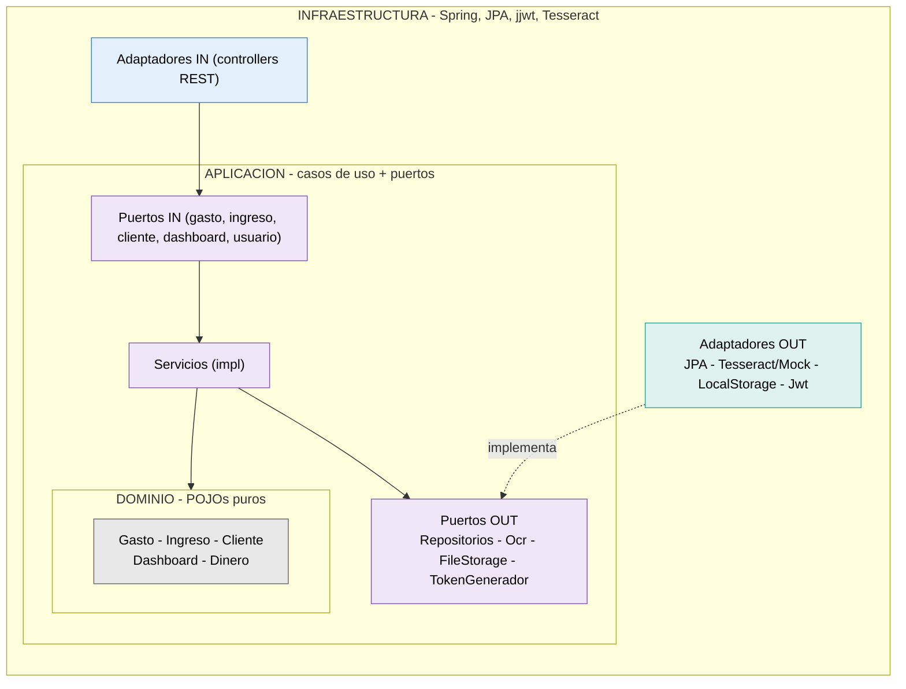

# GestionFacturas — Control económico para autónomos

> ⚠️ **Proyecto en desarrollo activo.** Este README describe el estado actual y la
> dirección del proyecto, y evoluciona con él.

Aplicación para que **freelances y autónomos individuales** lleven el control de su
actividad económica: registran sus **gastos**, sus **ingresos** y sus **clientes**,
digitalizan facturas con OCR, y consultan un **dashboard** con su beneficio y rentabilidad
por cliente. Lo mantienen ordenado para entregar al gestor.

Principio rector: **organización y visibilidad, nunca asesoría fiscal ni facturación
oficial**. La app registra y reporta; no calcula la declaración ni emite facturas legales.

## El problema que resuelve

Gestionar la contabilidad siendo autónomo es un caos manual: facturas desperdigadas,
ingresos sin controlar, cobros que se pierden de vista, y un desastre que ordenar cada
trimestre. La app ataca ese dolor siendo fuerte en cuatro cosas: capturar sin esfuerzo
(foto -> datos), no perder nada, entender el dinero (qué entra, qué sale, cuánto queda,
quién me debe, por cliente), y entregar ordenado al gestor.

## Público objetivo

Freelances y autónomos individuales que trabajan con un gestor externo. La app no sustituye
al gestor: le da el trabajo ya ordenado.

## Stack tecnológico

| Capa | Tecnología |
|------|-----------|
| Lenguaje | Java 21 |
| Framework | Spring Boot 4.1.x |
| Base de datos | PostgreSQL |
| Migraciones | Flyway |
| Seguridad | Spring Security + JWT (access + refresh revocable) |
| Rate limiting | Bucket4j (en memoria) |
| OCR | Tesseract vía Tess4J (español); mock para desarrollo/tests |
| Almacenamiento de archivos | Sistema de archivos local (MinIO planificado) |
| Documentación API | OpenAPI / Swagger (springdoc 3.x) |
| Build | Maven |
| Tests | JUnit 5 + Mockito + AssertJ |
| Entorno | Docker Compose (PostgreSQL) |
| Cliente | Kotlin Multiplatform (KMP) + Compose Multiplatform *(planificado; móvil + escritorio)* |

## Arquitectura

Arquitectura **hexagonal (puertos y adaptadores)**, tres capas con las dependencias
apuntando siempre hacia el dominio:

- **domain** — núcleo de negocio. POJOs puros, sin Spring ni JPA.
- **application** — casos de uso + puertos (interfaces in/out).
- **infrastructure** — adaptadores (web, persistencia, OCR, storage, seguridad) + config.

**Regla de dependencia:** `infrastructure` conoce `application`, que conoce `domain`. El
dominio no conoce a nadie. La aplicación **define** los puertos; la infraestructura los
**implementa**. Para cada entidad hay tres modelos separados (DTO / dominio / entidad JPA)
con mappers entre ellos.


```mermaid
flowchart TB
    subgraph INFRA["INFRAESTRUCTURA - Spring, JPA, jjwt, Tesseract"]
        direction TB
        subgraph APP["APLICACION - casos de uso + puertos"]
            direction TB
            subgraph DOM["DOMINIO - POJOs puros"]
                D1["Gasto - Ingreso - Cliente<br/>Dashboard - Dinero"]
            end
            PIN["Puertos IN (gasto, ingreso, cliente, dashboard, usuario)"]
            SVC["Servicios (impl)"]
            POUT["Puertos OUT<br/>Repositorios - Ocr - FileStorage - TokenGenerador"]
        end
        AIN["Adaptadores IN (controllers REST)"]
        AOUT["Adaptadores OUT<br/>JPA - Tesseract/Mock - LocalStorage - Jwt"]
    end

    AIN --> PIN
    PIN --> SVC
    SVC --> DOM
    SVC --> POUT
    AOUT -.implementa.-> POUT

    classDef dom fill:#e8e8e8,stroke:#666,color:#000
    classDef app fill:#efe6f7,stroke:#8257b5,color:#000
    classDef adin fill:#e3f0fb,stroke:#3b82c4,color:#000
    classDef adout fill:#e0f2ef,stroke:#2fa894,color:#000
    class D1 dom
    class PIN,SVC,POUT app
    class AIN adin
    class AOUT adout
```

## Módulos de dominio

- **gasto** — dinero que sale. Manual o por OCR. Opcionalmente imputable a un cliente.
- **ingreso** — dinero que entra: facturas emitidas a un cliente (obligatorio). Estado de
  cobro (PENDIENTE/COBRADA) que el usuario marca a mano.
- **cliente** — a quién factura el usuario. Soft delete.
- **usuario** — identidad y autenticación.
- **dashboard** — vistas de solo lectura que agregan gasto/ingreso/cliente (sin tabla
  propia): resumen de periodo, rentabilidad por cliente, pendientes de cobro.

## El dashboard (Fase 3)

Tres vistas, construidas sobre calculadoras de dominio puras (testeadas con TDD, sumas
comprobadas a mano):

- **`GET /api/dashboard/resumen?desde=...&hasta=...`** — para el periodo: facturado y
  cobrado (con IVA y sin IVA), gastos, y cuatro cifras de beneficio (de caja y facturado,
  cada una en total y en base imponible).
- **`GET /api/dashboard/rentabilidad-clientes?desde=...&hasta=...`** — el mismo resumen,
  desglosado por cliente. Los gastos sin cliente asignado se agrupan en una entrada "sin
  cliente" aparte.
- **`GET /api/dashboard/pendientes-cobro`** — lista de ingresos aún no cobrados, con su
  importe total agregado.

> ⚠️ **Incidencia conocida, en investigación:** en pruebas manuales, con dos clientes activos
> con ingresos cada uno, `rentabilidad-clientes` devolvió solo uno de los dos. La calculadora
> de dominio y el servicio se revisaron y parecen correctos; se sospecha del adaptador de
> persistencia que trae los ingresos del periodo, pero no está confirmado. No dar por fiable
> esta vista con más de un cliente hasta verificarlo con datos controlados.

## Seguridad

- Contraseñas con **BCrypt**. Autenticación **JWT**: access token corto + refresh token
  revocable (hash SHA-256 en BD). Logout real. Control de acceso por `usuarioId`.
- **Rate limiting** (Bucket4j, en memoria): login 10/min por IP, registro 5/hora por IP,
  resto de endpoints 50/min por usuario. Supera el límite → HTTP 429 con `Retry-After`.

### Seguridad prevista (pendiente, sobre todo para el despliegue)

- Rotación de refresh tokens (detección de reuso).
- CORS (al conectar el cliente KMP).
- Cabeceras de seguridad HTTP (HSTS, CSP...) al desplegar tras HTTPS.
- Rate limiting distribuido con Redis (al escalar a varias instancias).
- IP real vía `X-Forwarded-For` (tras un proxy de confianza).
- Límite de tamaño de peticiones y subidas.
- Expiración de buckets de rate limiting inactivos.
- Secretos en gestor de secretos en producción.

## Digitalización (OCR)

Subes una imagen de factura -> se almacena -> Tesseract extrae el texto -> `FacturaTextParser`
saca los campos -> se crea el gasto en BORRADOR para revisar. OCR real con el perfil `ocr`;
mock por defecto. Pendiente: PDF, emisor, OCR asíncrono, MinIO, digitalización de ingresos.

## Estado actual

- **Fase 0 — Fundamentos** ✅ cerrada y testeada.
- **Seguridad (JWT + rate limiting)** ✅ implementada (falta rotación de tokens).
- **Fase 1 — Digitalización (OCR)** ✅ funcional para gastos.
- **Fase 2 — Ingresos y clientes** ✅ cerrada.
- **Fase 3 — Dashboard** ✅ funcional — resumen, rentabilidad por cliente, pendientes de
  cobro (ver incidencia conocida arriba, en investigación).

## Roadmap

| Fase | Foco |
|------|------|
| Fase 0 | Backend en pie, CRUD de gasto (hecho) |
| Seguridad | JWT + rate limiting (hecho; falta rotación) |
| Fase 1 | OCR + almacenamiento de archivos (hecho; faltan mejoras) |
| Fase 2 | Ingresos y clientes (hecho) |
| Fase 3 | Dashboard (hecho; incidencia en rentabilidad multi-cliente en investigación) |
| Fase 4 | Exportación al gestor, pulido, despliegue |
| Cliente | App KMP (móvil + escritorio) consumiendo la API |
| v1+ | Duplicados, recurrentes, presupuestos, categorización automática... |

## Cómo arrancar (desarrollo)

**Requisitos:** Java 21, Docker, Maven. Para OCR real: Tesseract con el idioma español.

```bash
docker compose up -d                 # PostgreSQL
cp .env.example .env                 # y rellenar (BD, JWT_SECRET, ruta tessdata)
./mvnw spring-boot:run               # arranca (mock OCR por defecto)
```

API en `http://localhost:8080`. Swagger UI en `http://localhost:8080/swagger-ui.html`
(botón "Authorize" para el token JWT).

## Tests

```bash
./mvnw test
```

Tests unitarios de dominio y servicios (JUnit 5 + Mockito + AssertJ). El login, el parser
de facturas, las reglas de cliente, las transiciones de cobro y las calculadoras del
dashboard se construyeron con TDD. Los tests usan el mock de OCR, nunca Tesseract real.

**Lección aprendida:** que los tests unitarios pasen no garantiza el comportamiento correcto
en producción — antes de dar algo por bueno, se verifica contra datos reales de la BD
(consulta SQL como referencia, comparación campo a campo con la respuesta de la API).

## Variables de entorno

Ver `.env.example`: `DB_URL`, `DB_USERNAME`, `DB_PASSWORD`, `JWT_SECRET`, `SERVER_PORT`, y
la ruta de datos de Tesseract. Nunca subir el `.env` real ni la clave JWT a Git.

---

*Proyecto personal en desarrollo. La documentación se amplía conforme avanzan las fases.*
